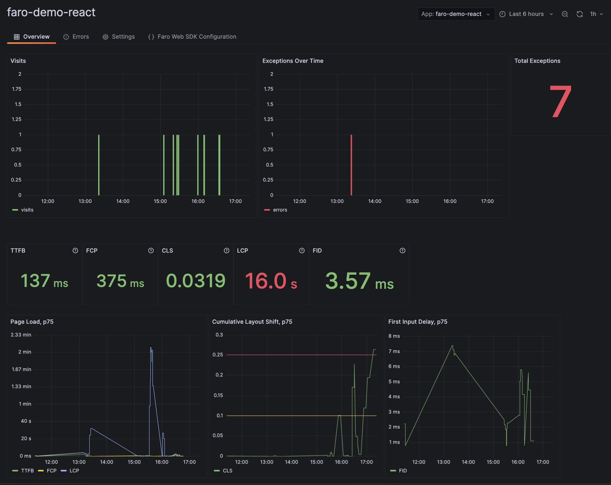
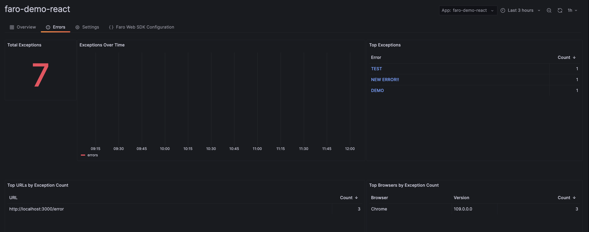
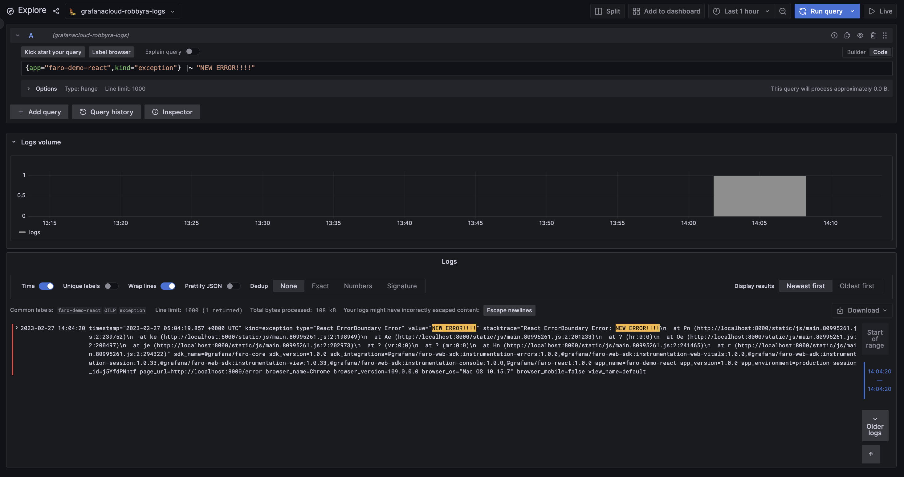
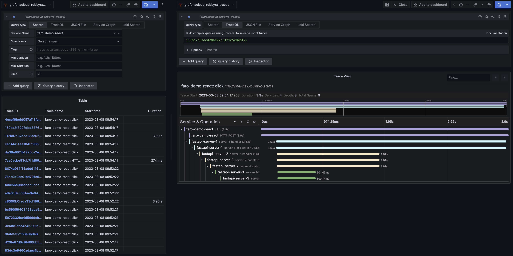

# Grafana Faro Demo with React

- 이 레포지토리는 [Grafana Faro](https://grafana.com/oss/faro/)를 사용해 React application에  
  observability를 적용하는 예시 코드가 담겨 있습니다.

- [Faro-Web-SDK](https://github.com/grafana/faro-web-sdk)를 사용해 React application으로부터 trace, log, web vital 등을 수집하고 [Grafana Faro](https://grafana.com/oss/faro/)에 전송합니다.

> 현재 시점(2023.03) 기준으로 Grafana Faro는 Grafana Cloud에서 private beta로 제공되고 있습니다.

- 아래는 Grafana Cloud에서 확인할 수 있는 Faro의 Dashboard입니다.

  
  

- 아래는 Loki에서 확인할 수 있는 로그 입니다.

  

- 마지막으로 아래는 OpenTelemetry를 통해 서버와의 통신 과정을 distributed tracing으로 Tempo에서 확인한 모습입니다.

  

  - 위에서 보여진 서버 3개의 코드는 각각 다음와 같습니다.

    - [fastapi-server-1](https://github.com/Example-Collection/fastapi-server-1)
    - [fastapi-server-2](https://github.com/Example-Collection/fastapi-server-2)
    - [fastapi-server-3](https://github.com/Example-Collection/fastapi-server-3)

---

## 실행 방법

- TODO
